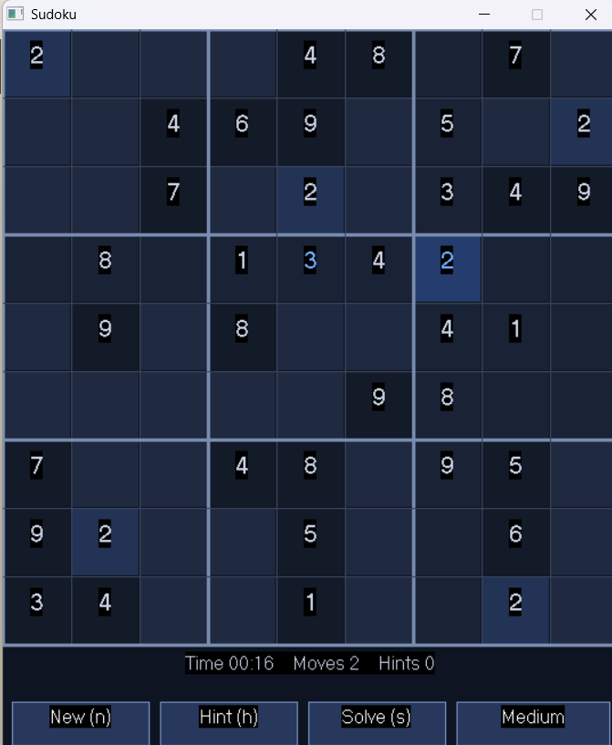

# Sudoku (C++)

A complete 9×9 Sudoku game written from scratch in modern C++ — featuring a recursive
**backtracking solver**, real-time move validation, and randomized puzzle generation at three
difficulty levels. Ships in two forms: a portable **console** version and a **windowed GUI**
version with a clickable grid.

<p align="center">
  
</p>

## Highlights

- **Recursive backtracking solver** that can solve any valid board, and a randomized variant used to generate fresh puzzles.
- **Real-time constraint checking** — every move is validated against its row, column, and 3×3 box; illegal moves are rejected immediately.
- **Puzzle generation** at Easy / Medium / Hard (35 / 45 / 55 blank cells) from a fully solved, randomized board.
- **Hint system**, **move counter**, and a live **timer**.
- Clean separation between game logic and presentation — the same engine drives both the console and GUI front ends.

## What this project demonstrates

| Area | Where to look |
|------|---------------|
| Recursion & backtracking | `solve()` / `fillBoard()` |
| Algorithmic constraint validation | `isValid()` |
| Randomized generation (Mersenne Twister, shuffling) | `generatePuzzle()` |
| Event-driven GUI programming (mouse + keyboard) | `sudoku_gui.cpp` main loop |
| Modern C++ (`std::array`, `<random>`, structured bindings, C++17) | throughout |

## The two versions

| File | Description |
|------|-------------|
| [`sudoku.cpp`](sudoku.cpp) | **Console version.** Text board, keyboard commands. Compiles and runs on any OS with a C++17 compiler — the fastest way to try the engine. |
| [`sudoku_gui.cpp`](sudoku_gui.cpp) | **Windowed version.** Opens a real game window with a clickable grid, highlighting, and on-screen buttons (uses the WinBGIm `graphics.h` library on Windows). |

## Quick start — console version (any OS)

```sh
g++ -std=c++17 -O2 -o sudoku sudoku.cpp
./sudoku            # Windows: sudoku.exe
```

You'll be prompted to pick a difficulty (or enter your own puzzle), then play by typing
`row col value` (e.g. `1 3 7`). Commands: `hint`, `solve`, `quit`.

## Windowed version (Windows + WinBGIm)

The GUI build depends on **WinBGIm**, a `graphics.h` implementation for MinGW. The classic
precompiled `libbgi.a` is 32-bit and will **not** link against a modern 64-bit GCC, so use a
64-bit build of the library.

1. Obtain a **64-bit build** of WinBGIm (`graphics.h` + `libbgi.a`) and place the files in a
   folder such as `winbgim/`. The original WinBGIm only ships a 32-bit `libbgi.a`, so you'll
   need a 64-bit rebuild of the library to link against 64-bit GCC.
2. Compile (adjust the `-I` / `-L` paths to wherever you put the files):

   ```sh
   g++ sudoku_gui.cpp -o sudoku_gui \
       -I./winbgim -L./winbgim -std=c++17 -static \
       -lbgi -lgdi32 -lcomdlg32 -luuid -loleaut32 -lole32
   ```

3. Run `sudoku_gui` (Windows: `sudoku_gui.exe`). It's statically linked, so it needs no extra DLLs.

### GUI controls

- **Click** a cell to select it (highlights its row, column, box, and matching numbers)
- **1–9** to fill · **Backspace** / **0** to clear · **arrow keys** to move
- On-screen buttons / shortcuts: **New (n)**, **Hint (h)**, **Solve (s)**, difficulty toggle, **Quit (q / Esc)**

## License

Released under the [MIT License](LICENSE). The WinBGIm library is third-party with its own
license and is **not** included in this repository.
